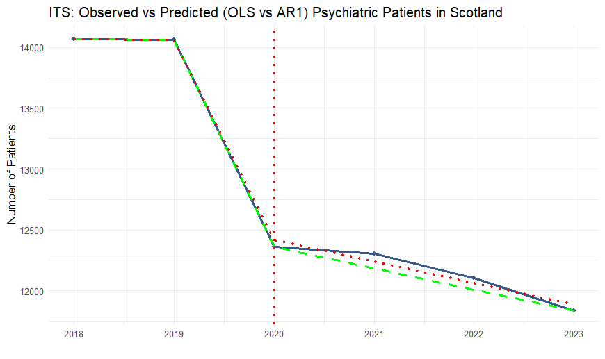
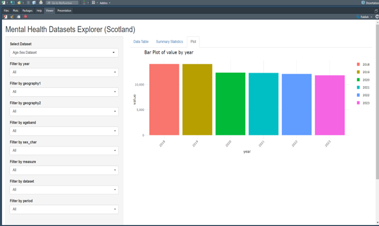

# Impact of COVID-19 on Mental Health in Scotland — Portfolio Repo

This repository contains the core analysis and an interactive **Shiny dashboard** from my MSc Applied Data Analytics dissertation (UHI, 2024–2025).  
It examines changes in mental health service usage around the COVID-19 intervention using **Interrupted Time Series** (GLS with AR(1)), alongside exploratory analyses by age/sex, diagnosis, data trends, and spending.

## Repository Structure
```
./
├─ Data/                # Cleaned datasets used by analysis and Shiny
├─ ShinyApp/            # Shiny dashboard (app.R ready for deployment)
├─ scripts/             # R scripts: ITS models + exploratory analysis
├─ outputs/             # Model outputs (e.g., coefficients, tables)
├─ plots/               # (optional) Saved figures
├─ docs/                # (optional) Screenshots / write-ups
└─ README.md
```

## Quickstart (Local)
1. Open the folder in **RStudio** (File → Open Project → select this folder).
2. Install packages (one-time):
   ```r
   install.packages(c("tidyverse","nlme","lubridate","ggplot2","readr","shiny","DT","plotly","shinyWidgets","scales","rsconnect"))
   ```
3. Run the Shiny app (locally):
   ```r
   shiny::runApp("ShinyApp")
   ```
4. Re-run analyses (examples):
   ```r
   source("scripts/ITS_integrated_AR1_model.R")
   source("scripts/ITS_Mixed_Effect_Analyses.R")
   source("scripts/exploration1AgeSex.R")
   ```

## Deploy the Shiny App to shinyapps.io
1. Create a free account at https://www.shinyapps.io/ and connect RStudio (`Tools → Global Options → Publishing`).
2. In RStudio, open `ShinyApp/app.R`, then run:
   ```r
   rsconnect::setAccountInfo(name = "YOUR_NAME",
                             token = "YOUR_TOKEN",
                             secret = "YOUR_SECRET")
   rsconnect::deployApp("ShinyApp")
   ```
   - On first deploy, RStudio will guide you to authorise your account.
3. After deployment, you’ll get a public URL like: `https://YOUR_NAME.shinyapps.io/mental-health-dashboard/`  
   Add this URL to your **README**, **LinkedIn**, and **CV**.

> Ensure the app reads its data with **relative paths** (as shipped: CSVs live inside `ShinyApp/` or `../Data/`).

## Recruiter-Facing Highlights (suggested bullets)
- **Methodology:** Interrupted Time Series (GLS AR(1)) to estimate post‑intervention level and slope changes.
- **Scale:** Multi‑year coverage with breakdowns by age/sex and diagnosis groups.
- **Result:** Statistically significant post‑COVID slope change in service usage (update with your real estimates).
- **Dashboard:** Interactive drill‑downs (age/sex, diagnoses, trends), downloadable tables, and reproducible code.

## Reproducibility (optional but recommended)
- Initialise a project environment with **renv**:
  ```r
  install.packages("renv")
  renv::init()
  renv::snapshot()
  ```
- Commit `renv.lock` so others can restore:
  ```r
  renv::restore()
  ```

## Visuals

### Interrupted Time Series Analysis


### Shiny Dashboard



## Licence
MIT (or your choice). See `LICENSE` if added.